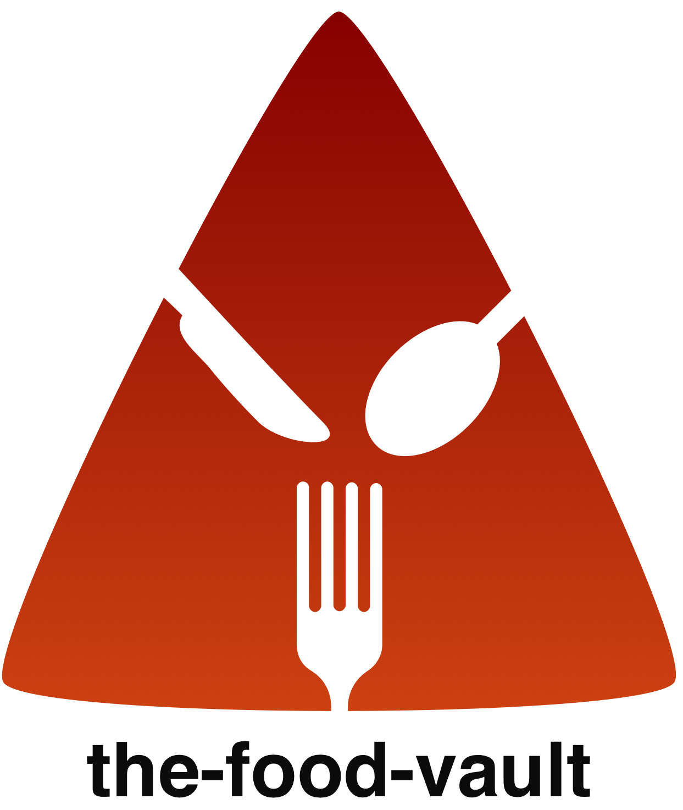

# the-food-vault

  

(the knife, spoon and fork icons used in the logo were created by Alrigel, Chocolate Icon and Themis Roberto Velgis Guevara respectively from the Noun Project)

FoodVault is a cross-platform mobile app to look at food recipes that was developed with expo. You can browse the various food categories and select one to see associated food recipes. The list of recipes for the selected category also displays its affordability, complexity and duration. Each recipe includes the ingredients required and the steps to prepare it.

## Screenshots
   img src="https://i.imgur.com/ILuQ4wjm.jpg" alt="" width="400" height="950" />

## Features
* Customised User Interface based on running platform (android or ios)
* Fully functional navigation: filters, meal categories, favorites
* List of recipes for a category also displays its affordability, complexity and duration
* Each recipe includes the ingredients required and the step-by-step instructions to prepare it.
* Ability to favorite a meal and save to the favorites page
* Ability to add filters for all recipes (vegan, lactose free, etc.)

## To play around and make your own changes
* You will need Xcode, Android Studio or the Expo Go mobile app to run on your own phone
* Install the latest version of [`Node.js`](https://nodejs.org/en/)
* Run `npm install --global expo-cli` to install the expo client
* Run `npm install` to install all other dependencies
* Start app by running `npm start`
* Make your changes
* Press `r` to reload app if hot reload does not reflect changes

